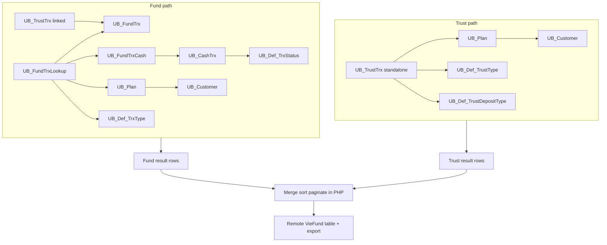

# Remote VieFund Query Flow (Simplified)

This diagram shows how the page data is assembled from Fund and Trust transaction sources.

## What this means

- Fund rows are built from Fund + Cash tables, then enriched with customer/type/status lookups.
- Trust rows are queried separately when they are standalone (`iTrxID = 0`).
- Trust rows that point to a fund transaction (`iTrxID > 0`) are attached in the Fund path as linked trust details.
- Both sets are merged later for presentation and export.
